 

- 🎓 4th-semester **Software Engineering** student @ UNIGRAN — 19 y/o, Mato Grosso do Sul, Brazil 🇧🇷
- 🧩 **Problem-driven development** — Crafting secure and efficient solutions with the best tools for the job
- 🛠️ I build **projects that solve problems from my own daily life**
- 🤖 Learning to use **AI as a force multiplier** in development
- 📚 Taking **CS50 (Harvard)**, learning from experienced engineers, applying good practices everywhere I can

 

 

**Languages**

**Backend**

**Frontend**

**Tools**

 

 

<table>
  <tr>
    <td>
      
    </td>
    <td>
      
    </td>
  </tr>
  <tr>
    <td>
      
    </td>
    <td>
      
    </td>
  </tr>
  <tr>
    <td colspan="2" align="center">
      
    </td>
  </tr>
</table>

⭐ **[ScraperCar](https://github.com/Augustbr01/ScraperCar)** — monitors vehicle deals and notifies via WhatsApp 
📋 **[TaskSys](https://github.com/Augustbr01/TaskSys)** — task management REST API (Java + Spring Boot) 
📖 **[VerseApp-V2](https://github.com/Augustbr01/VerseApp-V2)** — search and read Bible verses (React, Vite, Tailwind) 
🤖 **[ChatbotIA](https://github.com/Augustbr01/ChatbotIA)** — FastAPI chatbot with a web UI integrating LLMs 
🔐 **[SistemaLogin](https://github.com/Augustbr01/SistemaLogin)** — full-stack auth (FastAPI + SQLite)

 

 

  

 

 

<picture>
  <source media="(prefers-color-scheme: dark)" srcset="https://raw.githubusercontent.com/Augustbr01/Augustbr01/output/github-snake-dark.svg" />
  <source media="(prefers-color-scheme: light)" srcset="https://raw.githubusercontent.com/Augustbr01/Augustbr01/output/github-snake.svg" />
  
</picture>

 

 

&nbsp;

  

